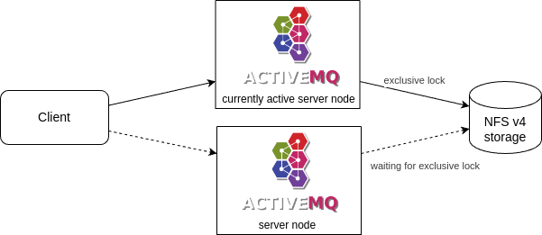
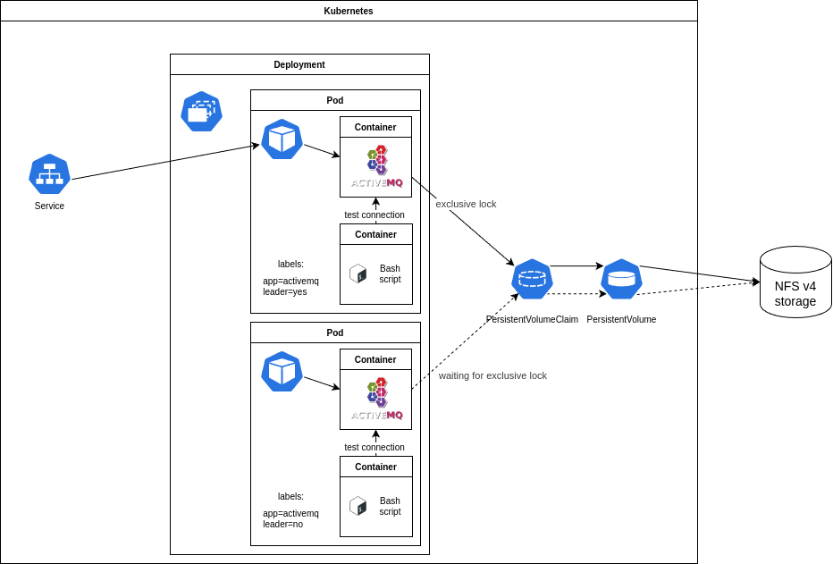

# activemq-kubernetes

## Copyright

(c) 2025 Mark Himsley

## Description

The intention of this project is to demonstrate creating a Highly Available ActiveMQ Classic cluster running in Kubernetes.

This repository contains Docker build files to create two Open Container Initiative (OCI) images to be used as containers in a Kubernetes Pod. One container runs ActiveMQ Classic, the other container runs a bash script to monitor the ActiveMQ container.

This repository also contains example Kubernetes [kubectl kustomize](https://kubernetes.io/docs/reference/kubectl/generated/kubectl_kustomize/) manifest fragments to create a highly available ActiveMQ instance running as a Deployment in a [Kubernetes cluster](https://kubernetes.io/docs/concepts/overview/components/). The example Kubernetes manifest fragments assume that some highly available NFS storage is available for storing persistent data and that the ActiveMQ services will be available to connect to from outside of the Kubernetes cluster.

Please make sure you are familiar with [ActiveMQ](https://activemq.apache.org/components/classic/), [building and publishing OCI images with Docker](https://docs.docker.com/get-started/docker-concepts/building-images/build-tag-and-publish-an-image/) and [Kubernetes](https://kubernetes.io/).

Warning: the [`jetty.xml`](src/base/activemq-config/jetty.xml) configuration includes the demo application context. You don't want that to be available on an ActiveMQ that is accessible to anyone who you do not trust.

## High Availability

The High Availability system used in here is ActiveMQ Classic's built-in [Shared File System Master Slave](https://activemq.apache.org/components/classic/documentation/shared-file-system-master-slave) (their words).

When multiple ActiveMQ Classic server nodes use a shared file system, such as NFS v4, to store their persistent data, the first server node will grab an exclusive lock on the filesystem and it will become the active server node. At that point the currently active server node will open it's network connections and ActiveMQ clients will be able to connect to this server node. All the other ActiveMQ Classicserver nodes will be waiting for the exclusive lock to be available and will not present open network connections.

When the currently active server node dies it will release the exclusive lock and another waiting server node will grab the exclusive lock and will turn into the currently active server node.

In traditional static ActiveMQ systems the ActiveMQ clients will be given a connection string including all of the ActiveMQ Classic server nodes. The client will try to connect to all of the server nodes in turn. Since only one of the ActiveMQ Classic server nodes will have open network connections the ActiveMQ clients will connect to the currently active server node. When the currently active server node dies the clients will try once again to connect to all of the server nodes in turn and will connect to the new currently active server node.



In a dynamic ActiveMQ system running in Kubernetes the ActiveMQ clients cannot know a list of ActiveMQ Classic servers. Instead the ActiveMQ clients are given one Kubernetes Service to connect to.

The Kubernetes Service cannot be left to load-balance across all of the ActiveMQ Pods because only one of them will be presenting open network connections. The Kubernetes Service must be guided to only forward connection requests from the ActiveMQ clients to the Pod running the currently active server node. This is achieved using labels on the Pods.

The template metadata for the ActiveMQ Pods sets labels of `app=activemq` and `leader=no` for all of the ActiveMQ Pods.

The ActiveMQ Kubernetes Service definition has a selector which is looking for Pods with the labels of `app=activemq` and `leader=yes`.

The ActiveMQ Pods consist of two containers. The first container runs the ActiveMQ Classic server. The second container runs a Bash script which constantly tries to connect to the local ActiveMQ Classic server in the Pod. When it can connect, which can only happen when the local ActiveMQ Classic server is the currently active server node, the script changes a label on its pod to be `leader=yes`. The Kubernetes Service now has one Pod it can route ActiveMQ client connections to.



When the currently active ActiveMQ Classic server node dies, the Pod it was running in will be deleted and a new Pod will be created with the label `leader=no`. But another of the waiting ActiveMQ Classic servers will have become the currently active server and the Bash script in that Pod will have updated its Pod label from `leader=no` to `leader=yes`. The Kubernetes Service will now route ActiveMQ client connections to that new currently active server in its Pod. This process typically takes a few seconds. The ActiveMQ clients should be able to withstand this change-over process.

## Build the OCI images

The Dockerfiles to build the [Active-MQ server](src/activemq/Dockerfile) and the [reddiness probe](src/activemq-readiness/Dockerfile) are located in the `src` folder.

I assume you'll be pushing the built OCI images to a local registry, so these are the commands you'll need to run from a shell at the root of this repository.

```console
docker build \
 -t <your-registry>/activemq:5.18.6 \
 src/activemq/

docker push \
 <your-registry>/activemq:5.18.6

docker build \
 -t <your-registry>/activemq-reddiness:5.18.6 \
 src/activemq-readiness/

docker push \
 <your-registry>/activemq-reddiness:5.18.6
```

You can override the ActiveMQ version with the following Dockerfile build arguments.

```text
 --build-arg "activemq_version=5.18.6" \
 --build-arg "postgresqljdbc_version=42.5.1" \
```

## Deploying to Kubernetes

This assumes that you have persistent storage available that you can make a `PersistentVolume` point to, via NFSv4 or something similar.

* Make a new kubectl kustomize override directory by copying the directory `override/example` and its contents to a new directory within the `override` directory.

  ```code
  pushd src/override
  cp -va example foo
  popd
  ```

In the copied override directory:

* Edit the file [`kustomization.yaml`](src/override/example/kustomization.yaml) to replace the current values for `images/newName` and `images/newTag` with your registry, image name, and tag.
* Edit the file [`activemq-config/jetty-realm.properties`](src/override/example/activemq-config/jetty-realm.properties) to set sensible usernames and passwords for the web admin pages of ActiveMQ Classic server.
* Edit the file [`service-patch.yaml`](src/override/example/service-patch.yaml) to set the `loadBalancerIP` address for the ActiveMQ service.
* Edit the file [`persistentVolume.yaml`](src/override/example/persistentVolume.yaml) to point to your storage.

Please check that the [`activemq.xml`](src/base/activemq-config/activemq.xml) and [`jetty.xml`](src/base/activemq-config/jetty.xml) configuration files contain only the configuration you require, and optionally override them in your override directory.

These kubectl kustomize manifest fragments assume that you will deploy the ActiveMQ system into a new `namespace` called `active-mq`. If that is not the case then edit the files [`kustomization.yaml`](src/override/example/kustomization.yaml) and [`namespace.yaml`](src/override/example/namespace.yaml) in your override directory to set the namespace you will use.

Now you should be ready to deploy the ActiveMQ system into your Kubernetes cluster. Check that the kustomized yaml manifests are correct by running `kubectl kustomize` against your override directory.

```code
kubectl kustomize src/override/foo
```

When you believe the output is correct, apply that to your kubernetes cluster.

```code
kubectl kustomize src/override/foo | kubectl apply -f - --context <cluster-name>
```

## Warranty

THE SOFTWARE IS PROVIDED "AS IS", WITHOUT WARRANTY OF ANY KIND, EXPRESS OR
IMPLIED, INCLUDING BUT NOT LIMITED TO THE WARRANTIES OF MERCHANTABILITY,
FITNESS FOR A PARTICULAR PURPOSE AND NONINFRINGEMENT. IN NO EVENT SHALL THE
AUTHORS OR COPYRIGHT HOLDERS BE LIABLE FOR ANY CLAIM, DAMAGES OR OTHER
LIABILITY, WHETHER IN AN ACTION OF CONTRACT, TORT OR OTHERWISE, ARISING FROM,
OUT OF OR IN CONNECTION WITH THE SOFTWARE OR THE USE OR OTHER DEALINGS IN THE
SOFTWARE.
